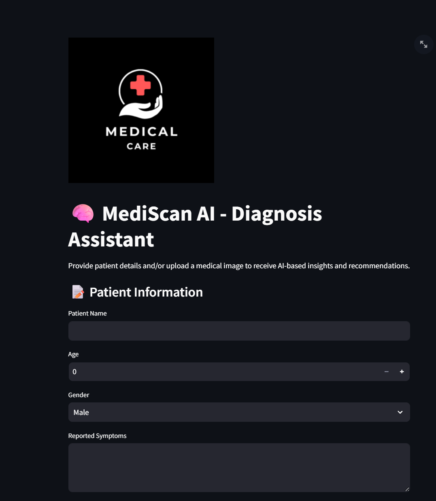
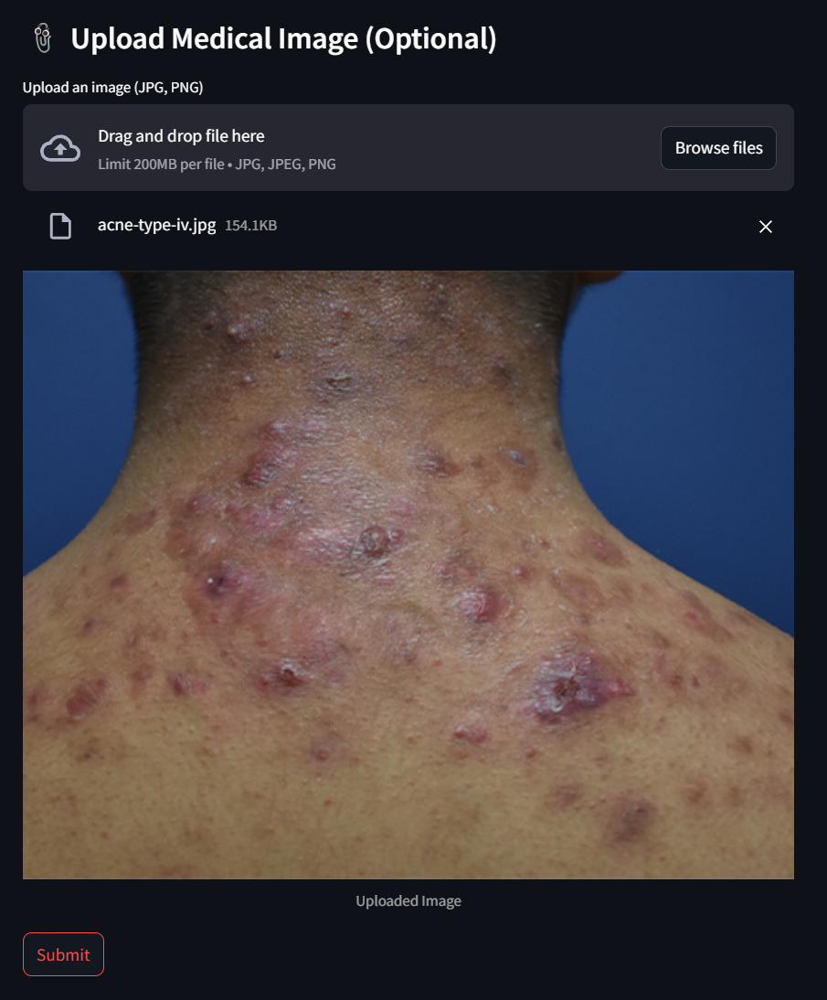
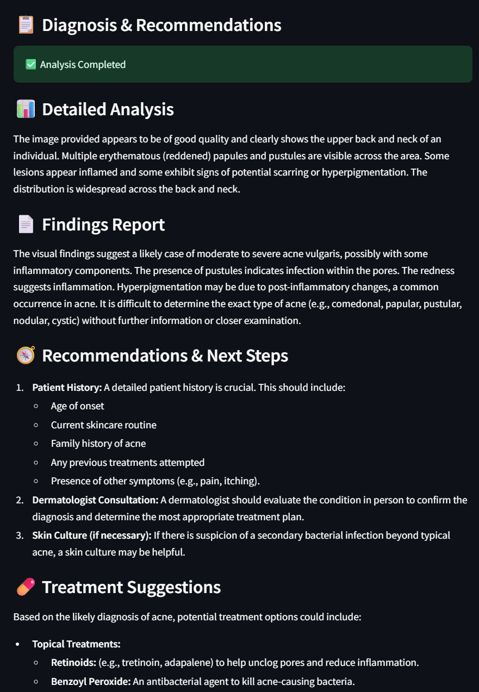

# 🩺 HealthAssist AI - Intelligent Medical Diagnosis Assistant


**HealthAssist AI** is a powerful medical assistant that utilizes **Gemini 1.5 Pro** (Text & Vision) to analyze patient details and medical images for smart diagnosis. Built with **Python** and **Streamlit**, it offers a user-friendly interface to input symptoms, upload images like X-rays or scans, and get accurate health suggestions powered by Google's AI.

---

## 🚀 Key Features

- 👤 Input patient details: Age, gender, symptoms, and history
- 🧠 Gemini Pro-powered diagnosis
- 🖼️ Upload X-ray or scan images for analysis
- 📋 Instant results and intelligent suggestions
- 🧪 Easy to run locally using Streamlit

---

## 📸 Screenshots

### 🏠 Home Page



### 🏠 Uploaded File Preview



### 🧠 Diagnosis Output



---

## 🛠️ Installation & Setup

### 📦 Prerequisites

- Python 3.10 or higher
- Gemini API key from [Google AI Studio](https://makersuite.google.com/app/apikey)

### 📥 Clone the Repo

```bash
git clone https://github.com/mohankrishna9347/HealthAssist-AI.git
cd HealthAssist-AI
```
### 📥 Install Required Packages

```
pip install -r requirements.txt

```
### ▶️ Run the Application

```
streamlit run app.py

